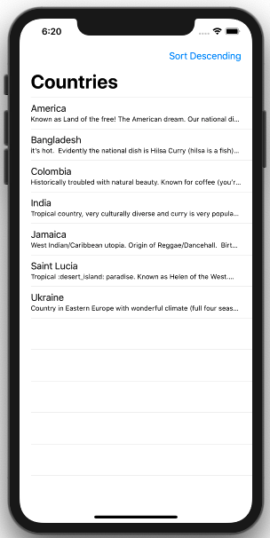
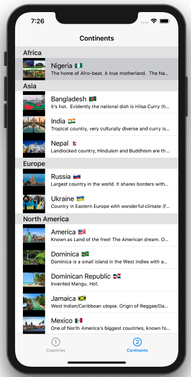

# TableViews

Introduction to UITableViews and UITableViewDataSource. In the process we overviewed UITableViewCell, IndexPath and what it means to dequeue a cell.

## Key classess and methods 

* [UITableView](https://developer.apple.com/documentation/uikit/uitableview)   
* [UITableViewDataSource](https://developer.apple.com/documentation/uikit/uitableviewdatasource) - 2 **required** protocol methods: `numberOfRows` and `cellForRow`   
* [UITableViewCell](https://developer.apple.com/documentation/uikit/uitableviewcell)   
* [IndexPath](https://developer.apple.com/documentation/foundation/indexpath) - key properties: `row` and `section`
* [dequeueReusableCell()](https://developer.apple.com/documentation/uikit/uitableview/1614891-dequeuereusablecell)   

## Topics Covered - Introduction

 * UITableView
 * cells can be static or dynamic
 * prototype cell
 * reuse identifier e.g "countryCell"
 * dataSource object (WE NEED TO SET THE DATASOURCE OBJECT e.g tableView.dataSource = self), configured in viewDidLoad()
 * UITableViewDataSource - 2 required methods
 * first required method is `numberOfRows()`
 * second required methods is `cellForRow()`
 * `dequeueCell` - recycles a cell if in memory, if not it creates a new cell
 * [indexPath.row] - gets object for row at current indexPath
 * UIBarButtonItem - button in navigation bar
 * extension {...} - used to extend a class, in our case to conform to the UITableViewDataSource
 
 ## Topics Covered - Table View Sections
 
 * [UITabBarController](https://developer.apple.com/documentation/uikit/uitabbarcontroller)   
 * UITabItem
 * `viewControllers relationship segue` connects a tab bar controller to a view controller
 * `Array(repeating: , count: )`
 * `numberOfSections()` - UITableViewDataSource method, returns number of sections in the table view
 * `titleForHeaderInSection()` - UITableViewDataSource method, returns a String for each section header
 * `prepare(for segue: )` - here you set the data to be passed to the destination view controller
 * segue.destination 
 * segue.source 
 * tableView.indexPathForSelectedRow
 * [indexPath.section][indexPath.row] - gets thte section and the row at the current indexPath

 
 ## TableView uses a dynamic prototype subtitle cell
 
 
 
 ## TableView sections, UITabBarController
 
   
